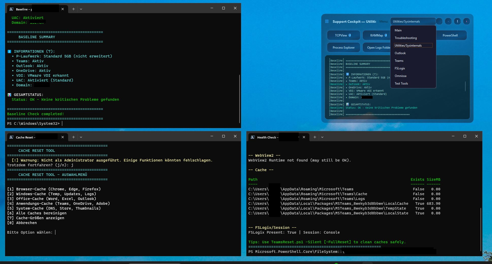
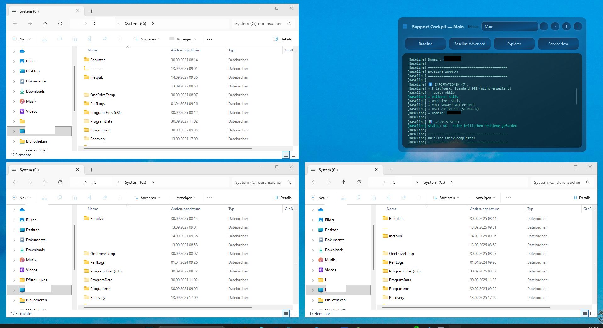

# InfraCommand – Support Cockpit

Disclaimer: InfraCommand is a practitioner driven project. The primary goal is to solve real support and operations problems in a reproducible way. The codebase is evolving from script style towards a more modular Python package, but it should be read as an engineer’s working tool, not as a polished framework.

It is the result of years of working in Windows and VDI support and seeing the same pattern over and over again:

- baseline checks are repeated manually,
- tools are started in random order and random positions,
- important signals are hidden in too many separate windows and logs.

Instead of adding one more tool, InfraCommand builds a small **support cockpit**:

- start the essential tools in a clean, repeatable layout,
- run a defined set of baseline checks,
- collect logs in one place for later analysis,
- make the “first 10 minutes” of every case predictable.

Most of the actual checks and actions are implemented as **PowerShell scripts**, so they can be adapted, extended or completely replaced to match a specific environment.

The goal is simple: take what experienced engineers do in their heads and turn it into a quiet, transparent workflow.

---

# InfraCommand — Support Cockpit

A modern Windows support and administration cockpit.  
InfraCommand provides a **central hub** for launching tools, running scripts, and managing sessions — optimized for IT support, system engineers, and hybrid environments.

## ✨ Features

- 🚀 **Launcher & Scripts**  
  Grid-based launcher with JSON configuration, direct PowerShell/CMD integration

- 🖥️ **Window Management**  
  Smart quadrant placement, UAC-aware launches, RDSH session support

- 🎨 **Modern UI/UX**  
  Qt-based dark theme, frameless design, responsive scaling

- 📊 **Operational Awareness**  
  Session-aware info, baseline automation, integrated logging

## 📸 Screenshots

| Main Interface | Full 3-Window View | Explorer Integration |
|:---:|:---:|:---:|
|  |  |  |
| Clean grid launcher | Multi-window management | Smart window placement |

## ⚙️ Installation

### Prerequisites
- Windows 10/11
- Python 3.8+
- PowerShell 5.1+

### Setup

1. **Clone repository:**
   ```bash
   git clone https://github.com/lukaspfisterch/infracommand.git
   cd infracommand
   ```

2. **Install dependencies:**
   ```bash
   pip install -r requirements.txt
   ```

3. **Configure settings:**
   ```bash
   # Copy example config
   copy grid.config.example.json grid.config.json
   # Edit grid.config.json and adjust tools/paths as needed
   ```

4. **Start:**
   ```bash
   python infracommand.py
   ```

## Configuration

### grid.config.json

```json
{
  "TOOLS_DIR": "%LOCALAPPDATA%\\Support\\Tools",
  "SCRIPTS_DIR": "./scripts",
  "LOCAL_LOG_DIR": "%LOCALAPPDATA%\\Support\\Logs\\Cockpit",
  "CENTRAL_LOG_DIR": "%LOCALAPPDATA%\\Support\\Logs_CENTRAL\\Cockpit",
  "TOOLS": {
    "Main": [
      {
        "label": "PowerShell",
        "type": "ps1",
        "path": "PowerShell.ps1",
        "elevate": false
      }
    ]
  }
}
```

### Tool Types

- **`ps1`** - PowerShell scripts
- **`cmd`** - CMD commands
- **`exe`** - Executables
- **`url`** - Web links

## Usage

### Basic Operation

1. **Start tool:** Click button
2. **Window positioning:** Automatic by quadrants
3. **UAC:** Automatic elevation for admin tools

### Keyboard Shortcuts

- `F11` - Fullscreen
- `ESC` - Close
- `Ctrl+Q` - Quit

## Development

### Project Structure

```
infracommand/
├── infracommand.py          # Main application
├── window_utils.py          # Window management
├── grid.config.json         # Configuration
├── scripts/                 # PowerShell scripts
│   ├── PowerShell.ps1
│   ├── CMD.ps1
│   └── ...
├── requirements.txt         # Python dependencies
├── README.md               # This file
└── LICENSE                 # License
```

### Contributing

1. Fork the repository
2. Create feature branch (`git checkout -b feature/AmazingFeature`)
3. Commit changes (`git commit -m 'Add some AmazingFeature'`)
4. Push branch (`git push origin feature/AmazingFeature`)
5. Create Pull Request

## License

This project is licensed under the MIT License - see [LICENSE](LICENSE) for details.

## Support

For issues or questions:
- Create an issue
- Check documentation
- Review code examples

## Changelog

### v1.0.0
- Initial release
- Grid-based tool launcher
- PowerShell integration
- UAC support
- Smart window placement

## Origin

InfraCommand started as a personal project to make my own 2nd-level work easier in a large clinical IT environment.  
The repository documents the ideas and implementation so that other support engineers can reuse, adapt or simply critique the approach.
